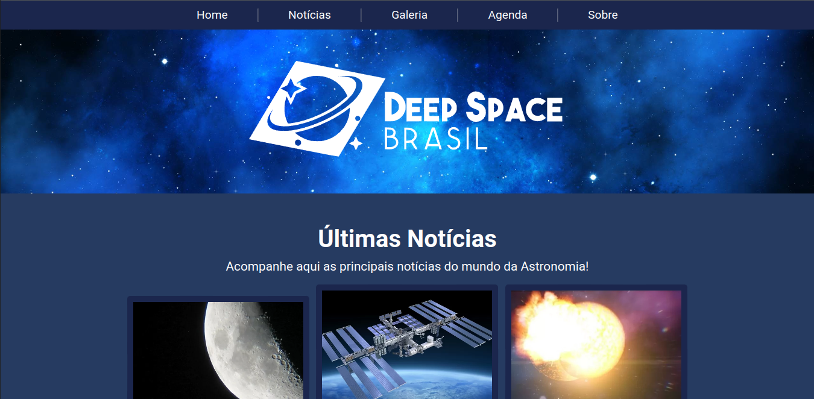
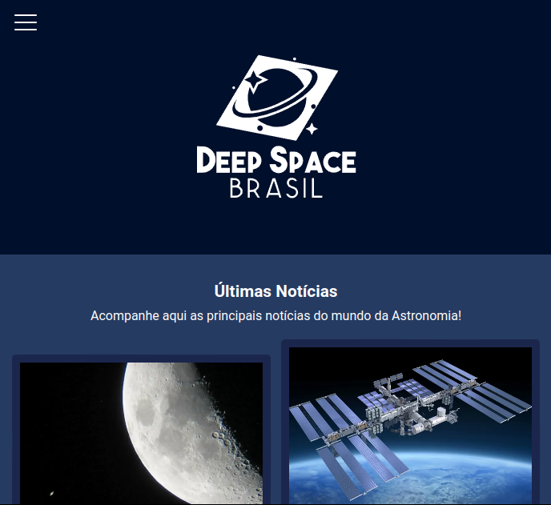
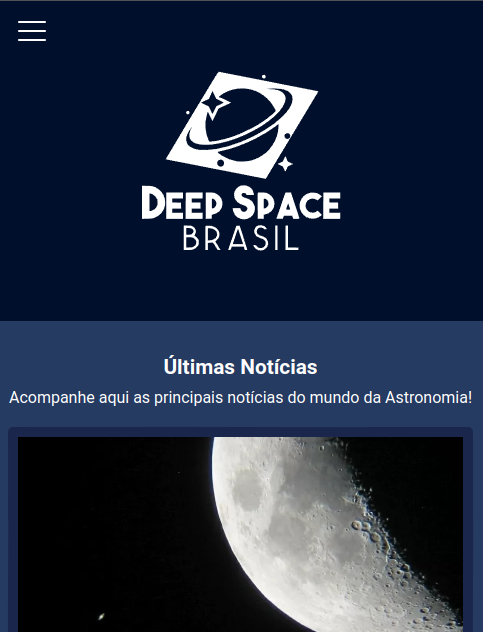
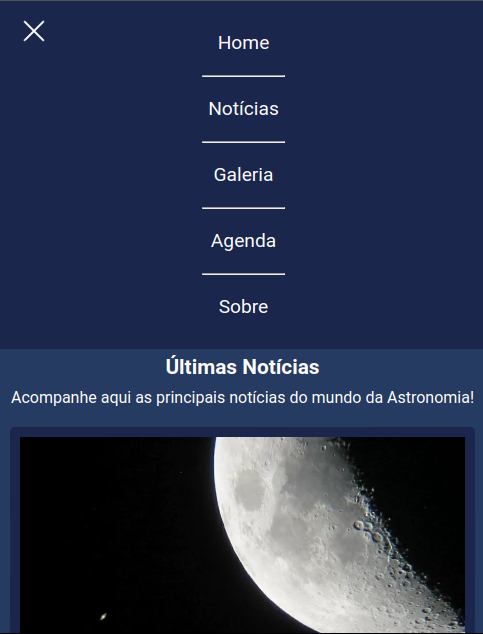

<h1 align="center">Deep Space Brasil</h1>

O Deep Space Brasil surgiu como meu projeto pessoal para por em prática os conhecimentos de desenvolvimento web front-end adquiridos no programa Oracle Next Education.

  
<h3 align="center">Desenvolvido por:
    <a href="https://www.linkedin.com/in/lp-ramos/" target="_blank">Leandro Ramos</a>
</h3>

## Tecnologias Utilizadas:
- HTML, CSS, JavaScript e Python para compressão das imagens.